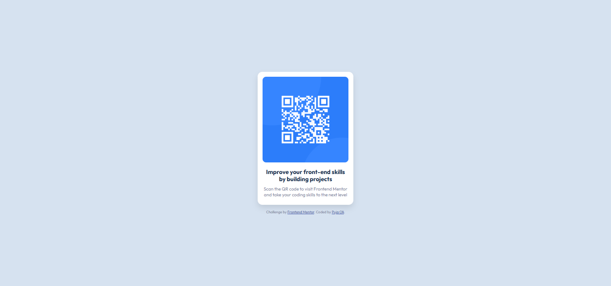

# Frontend Mentor - QR code component solution

This is a solution to the [QR code component challenge on Frontend Mentor](https://www.frontendmentor.io/challenges/qr-code-component-iux_sIO_H). Frontend Mentor challenges help you improve your coding skills by building realistic projects. 

## Table of contents

- [Overview](#overview)
  - [Screenshot](#screenshot)
  - [Links](#links)
- [My process](#my-process)
  - [Built with](#built-with)
  - [What I learned](#what-i-learned)
  - [Continued development](#continued-development)
  - [Useful resources](#useful-resources)
- [Author](#author)
- [Acknowledgments](#acknowledgments)


## Overview

### Screenshot




### Links

- Solution URL:https://github.com/puja-oli/qr-code-component
- Live Site URL: https://puja-oli.github.io/qr-code-component/

## My process

### Built with

- Semantic HTML5 markup
- CSS custom properties
- Flexbox
- CSS Grid
- Mobile-first workflow


### What I learned

Through this project, I practiced:

Creating a simple QR code component layout using Flexbox for centering and alignment.

Applying custom CSS for visual design, including box shadows, rounded corners, and typography.

Enhancing accessibility with semantic HTML and appropriate alt attributes for images.


To see how you can add code snippets, see below:

```html
<h1>Some HTML code I'm proud of</h1>

```
```css
body {
  font-family: 'Outfit', sans-serif;
  background-color: hsl(212, 45%, 89%);
  display: flex;
  justify-content: center;
  align-items: center;
  min-height: 100vh;
  flex-direction: column;
  padding: 1rem;
}
```

### Continued development

For future projects, I would like to refine my skills in:

Mobile-first design and creating responsive layouts that adapt well across devices.

Using modern CSS features like Grid and Flexbox to create more complex layouts.

Implementing more interactive elements using JavaScript, such as QR code scanning or dynamic content.


### Useful resources

- Flexbox Froggy - This interactive tool helped me understand Flexbox better.
- MDN Web Docs - A great resource for detailed CSS documentation and examples.

## Author


- Frontend Mentor - [@puja-oli](https://www.frontendmentor.io/profile/puja-oli)

## Acknowledgments

Thanks to Frontend Mentor for providing this challenge, which helped me practice my front-end skills.

Special thanks to Mozilla Developer Network (MDN) for their excellent documentation on CSS and HTML that I frequently refer to.